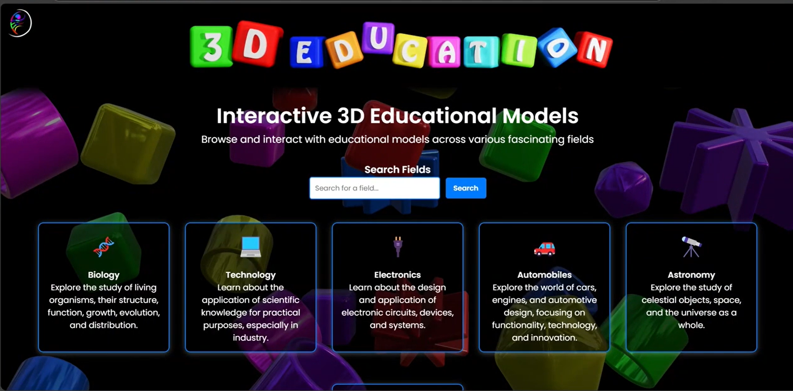

# 🎓 3D_EDUCATION

A modern interactive learning platform that lets users explore 3D models, hover to highlight components, and instantly get AI-powered explanations. Perfect for teaching, engineering demos, biology models, architecture, and hands-on learning.

---

## 📸 Snapshots

**Demo Preview — Click image to watch**
<br>
[](public/vid.mp4)

---

## 🧠 What This App Does

3D_EDUCATION makes learning visual and interactive:

* Hover to highlight parts of a 3D model
* Click a highlighted part to get an AI-generated explanation
* Smooth 3D navigation with orbit, zoom, and pan
* Learn faster by exploring instead of reading long text

---

## 💡 Why This Exists

* Visual learners understand complex structures faster
* Teachers can present detailed models interactively
* Perfect for engineering, biology, architecture, anatomy, and product demos
* Turns passive reading into active, intuitive learning

---

## ✨ Key Features

* Load 3D models (GLTF, GLB, OBJ — extendable)
* Hover to identify and highlight model components
* AI explanations for clicked parts
* Smooth orbit/zoom/pan navigation
* Clean minimal UI with explanation pane
* Lightweight server — easy to run locally for demos

---

## 🚀 Quick Start (Local Setup)

**Requirements:**

* Node.js v14+
* npm

**Install and Run:**

```
npm install
node server.js
```

**Open in browser:**

```
http://localhost:3000
```

---

## 🗂️ Folder Structure

```
3D_EDUCATION/
├── public/
│   ├── image.png
│   ├── vid.mp4
│   └── models/
├── src/
│   ├── components/
│   ├── ai/
│   ├── hooks/
│   └── utils/
├── server.js
└── README.md
```

---

## 🛠️ Tech Stack

* Three.js — 3D rendering
* Node.js / Express — backend
* OpenAI API or LLM — AI explanations
* HTML / CSS / JavaScript — UI interactions

---

## 🤝 Contributing

Contributions, feature ideas, and issues are welcome!

---

## ⭐ Support

If you like this project, please star ⭐ the repository to support development.
